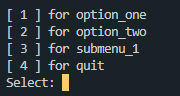

# Terminal Menu

Dynamic Python menu for the terminal
By Jacob Gesink

Spend less time on user inputs and more time on coding.

This menu allows you to write classes and functions directly into menu items.
It allows for submenu nestling and should be a quick solution to any python
project that requires the terminal window for user selection.

## Features:

- Create a dynamic menu directly from the functions in a class
- Naming of menu items is linked to the function names
- Class names are descriptive only and hidden from the end user
- **init** is ignored in the menu building and can be freely used

## Installation

import menu.py into your project.

(import sys and os are optional)

## Usage

```python
from menu import Menu
import sys

# use function menu_builder to make a menu
def menu_builder(class_name):
    menu_instance = Menu(class_name)
    menu_instance.draw()
    getattr(globals()[menu_instance.class_name_str](), menu_instance.option)()

# create a class to fill the menu with names and operations
class MainMenu:
    def option_one(self):
        print("Main menu option one")

    def option_two(self):
        print("Main menu option two")

    def submenu_1(self):
        menu_builder(SubMenuOne)

    def quit(self):
        print("Quit program" + "\n")
        sys.exit(0)
```

## Returns menu



## Contributing

Pull requests are welcome. For major changes, please open an issue first
to discuss what you would like to change.

Please make sure to update tests as appropriate.

## License

[MIT](https://choosealicense.com/licenses/mit/)
